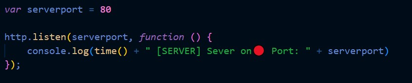

<p align=center>
  <br>
  
  <br>
  <br>
  <a target="_blank" href="https://www.youtube.com/channel/UCoif-_aktkxpc9-vPHEKAVw" title="Nightly Tests">Talk2 Studios</a>
  <a target="_blank" href="talk2-studios.ch"> talk2-studios.ch</a>
</p>

# Talk2 Chat
Talk2 Chat usere eigen entwikelte Webchatapp zum Donloaden und selbst ausprobieren.
# Instalation
## Node installieren
1. Laden sie sich node <a href="https://nodejs.org/de/download/">hier</a> herunter und installieren es auf ihrem pc.
2. Erstellen sie auf ihrem Computer ein Verzecihnis indem sie die Website speichern wollen
3. Danach öfnen sie das als administrator das Terminal in diesem verzeichis.
4. Im Terminel erstellen sie ein node modules Ortner mit:
```
$ npm install --save socketio
$ npm install --save express@4.15.2
```
## Port
If you would like to chanche the Port the server is linsten on, open the index.js file and chanche the number in the 8. line of the file to the port you like.
  
