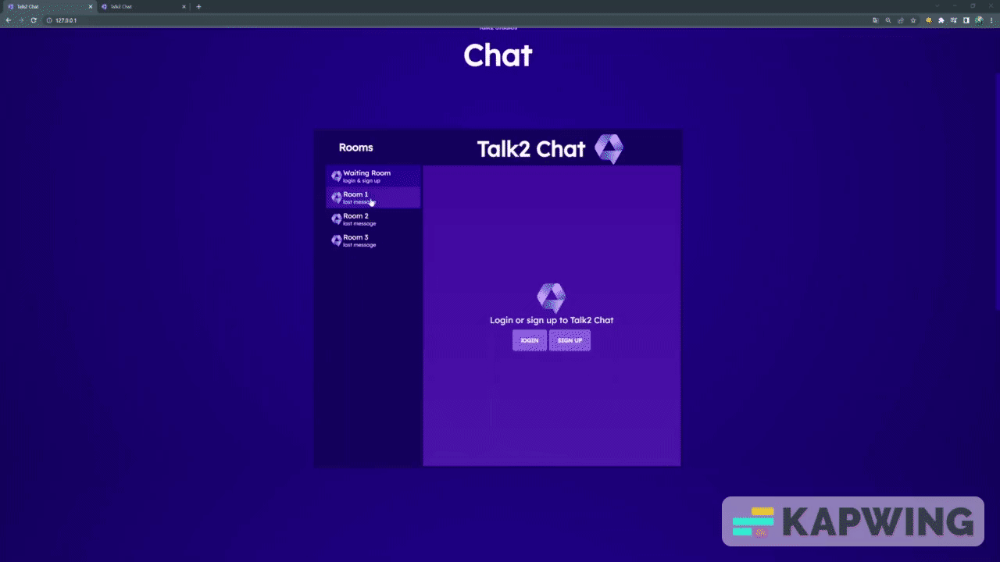

<p align=center>
  <br>
  
  <br>
  <br>
  <a target="_blank" href="https://www.youtube.com/channel/UCoif-_aktkxpc9-vPHEKAVw" Tests">Talk2 Studios</a>
  <a target="_blank" href="talk2-studios.ch"> talk2-studios.ch</a><br><br>
  <a href="#einleitung">Talk2 Chat</a>
  &nbsp;&nbsp;&nbsp;|&nbsp;&nbsp;&nbsp;
  <a href="#installation">Installation</a> 
  &nbsp;&nbsp;&nbsp;|&nbsp;&nbsp;&nbsp;
  <a href="#port">Port</a>
  &nbsp;&nbsp;&nbsp;|&nbsp;&nbsp;&nbsp;
  <a href="#styles">Styles</a>               
  <br><br>
  
</p>
<a id="einleitung"></a>
                  
# Talk2 Chat
Our own chatapp to download and try for yourself. A product of the third laboratory work of the 2022 Wibilea Bassislehrjahr.<br>
Explain video: <a href="https://youtu.be/SobWpdG1_NE">Video</a>
                                                 
## contributing
                                                  
### Frontend
- Colin Heggli
                                                  
### Backend
- Niklaus Külling<br>
                                                  
# Installation

## install and init node.js
if You already installed node.js you can skip the first point.
1. Download node <a href="https://nodejs.org/de/download/" target="_blank">hier</a> and install it on your PC.
2. Create a new folder where you want to save the Website and copy all he stuff from github in this folder
3. Open the Terminal as **administrator** and navigate to the folder you just have created.
4. Now we init a node Projekt (optional):
```
$ npm init

// Now you can set some informations about your projekt.
```

6. install socket.io and express
```
$ npm install --save socketio

$ npm install --save express@4.15.2
```

## Port
If you would like to chanche the Port the server is linsten on, open the index.js file and chanche the number in the 8. line of the file to the port you like. <br>
  

## Styles
- Roome style: The main style for the room.htmls is in the maine Directory `/style.css`<br>
- Iframe and room switch: The style for the Iframe and the chat room icons in in `/styles/style.css`<br>                              
- Waiting room style: The style for the wait.html is in `/styles/wait.css`<br>
- Main Page style: The Style for the main index.html is in `/styles/mainstyle.css`<br>
